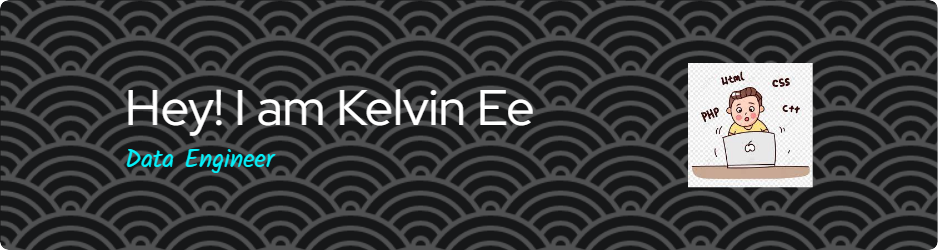

---
### :woman_technologist: About Me :

- 📆 22/06/2001
- 👯 I’m currently study at University Technology Malaysia
- 🌱 I’m currently learning application development
- ⚡ In my free time, I like to watch movies.
- 💬 Ask me anything that you are interested about me
- 📫 How to reach me:  

---

### 🏅 Achievements :
- 🚘 [Python Big Data EDA: Car Sales in Russia](https://github.com/Kelvinnn-2/Python-big-data/tree/main/Assignment%201/Boboiboy)
- 🏥 [EDA on a property listing website for properties for sale in Kuala Lumpur, Malaysia](https://github.com/Kelvinnn-2/Python_EDA/tree/main/Malaysia%20EDA/Boboiboy)
- ✈ [Project: New York City Automated Traffic Volume Counts](https://github.com/drshahizan/Python-big-data/tree/main/Project/QwQ)
- 🛒 [Web Scraping Malaysia States website using Beautiful Soup](https://github.com/Kelvinnn-2/python-web/tree/main/beautiful-soup/QwQ)

---
### :hammer_and_wrench: Languages and Tools :

  &nbsp;
  &nbsp;
  &nbsp;
  &nbsp;
  &nbsp;
  &nbsp;
  &nbsp;
  &nbsp;
  &nbsp;
  

<h4 align="left"> 📊 Data Visualization:</h4>

<a href="https://getbootstrap.com" target="_blank" rel="noreferrer"> 
<a href="https://getbootstrap.com" target="_blank" rel="noreferrer"> 

 ## 🔔 𝙼𝚢 𝙻𝚊𝚝𝚎𝚜𝚝 𝙶𝚒𝚝𝙷𝚞𝚋 𝙼𝚎𝚝𝚛𝚒𝚌𝚜

